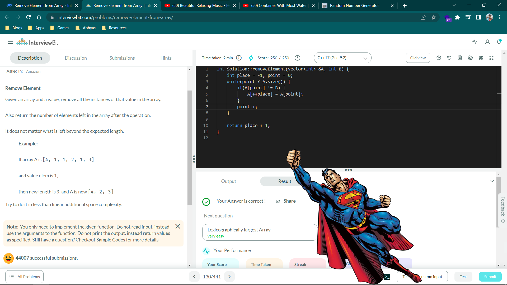

# Remove Element from Array





Solved in under 3 minutes. Got Superman for this question.

```cpp
int Solution::removeElement(vector<int> &A, int B) {
    int place = -1, point = 0;
    while(point < A.size()) {
        if(A[point] != B) 
            A[++place] = A[point];
        point++;
    }
    
    return place + 1;
}
```
